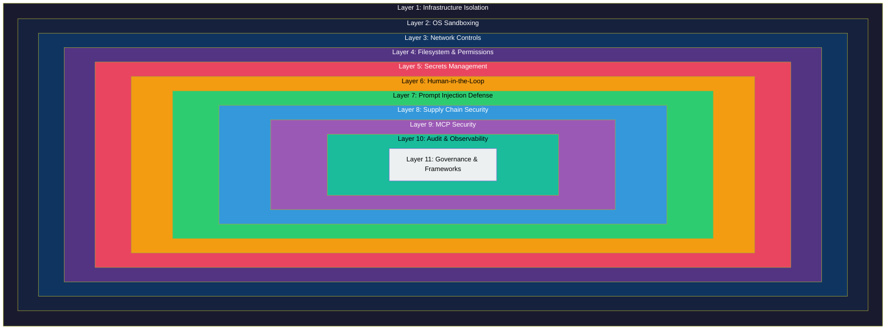

# AI Coding Agent Security: A Defense-in-Depth Reference Architecture

A practical, layered security framework for organizations deploying AI coding agents in development workflows.

## Who This Is For

- **Security teams** establishing guardrails for AI-assisted development
- **Engineering leads** evaluating and deploying AI coding tools safely
- **Developers** using Claude Code, GitHub Copilot CLI, Cursor, Windsurf, or similar agents
- **CISOs and compliance officers** building governance around agentic AI

## The Threat in Numbers

> **The attack surface is real, measured, and growing.**
>
> - **41--83%** prompt injection success rates across major AI coding platforms
> - **30+ CVEs** disclosed across Claude Code, Copilot, and Cursor in 2025--2026
> - **36%** of AI agent skills contain security flaws (Snyk ToxicSkills, Feb 2026)
> - **72%+** tool poisoning attack success rate on MCP servers
> - **20%** of AI-generated code references hallucinated (non-existent) packages
> - **First documented AI-orchestrated espionage campaign** -- GTG-1002, Sep 2025, targeting ~30 entities with 80--90% automation

These are not theoretical risks. Every statistic above comes from published research or disclosed incidents within the last twelve months.

## Defense-in-Depth Layer Model

Security for AI coding agents cannot rely on a single control. The following model nests eleven layers from infrastructure (outermost, strongest isolation) to governance (innermost, organizational controls). A failure at any single layer is contained by the layers surrounding it.

## Security Controls Summary Matrix

Each layer links to a detailed document covering threats, controls, implementation guidance, and tool-specific notes.

| Layer | Threats Mitigated | Key Tools / Techniques | Difficulty | Impact |
|-------|-------------------|------------------------|------------|--------|
| [1. Infrastructure Isolation](docs/01-infrastructure-isolation.md) | Full system compromise, container escape | Codespaces, Firecracker, E2B, Docker | High | Highest |
| [2. OS Sandboxing](docs/02-os-sandboxing.md) | Unauthorized syscalls, file access beyond scope | Seatbelt, bubblewrap, seccomp, Landlock | Medium | Very High |
| [3. Network Controls](docs/03-network-controls.md) | Data exfiltration, C2 communication, SSRF | Egress filters, agent proxies, Pipelock | Medium | Very High |
| [4. Filesystem & Permissions](docs/04-filesystem-permissions.md) | Unauthorized file access, overprivileged operations | `.aiignore`, allowlists, least privilege | Low | High |
| [5. Secrets Management](docs/05-secrets-credentials.md) | Credential theft, env variable leakage | Env scrubbing, credential brokers, short-lived tokens | Medium | High |
| [6. Human-in-the-Loop](docs/06-human-in-the-loop.md) | Destructive actions, unintended modifications | Approval workflows, permission modes | Low | High |
| [7. Prompt Injection Defense](docs/07-prompt-injection.md) | Direct/indirect injection, instruction hijacking | Input validation, output filtering, confirmation gates | High | High |
| [8. Supply Chain Security](docs/08-supply-chain.md) | Hallucinated dependencies, malicious packages | Lockfiles, SBOM, dependency scanning, code review | Medium | High |
| [9. MCP Security](docs/09-mcp-security.md) | Tool poisoning, confused deputy, token theft | Mutual auth, scoped OAuth, server-side authz | High | High |
| [10. Audit & Observability](docs/10-audit-observability.md) | Undetected breaches, compliance violations | Activity logging, behavioral analysis | Medium | Medium |
| [11. Governance & Frameworks](docs/11-governance-frameworks.md) | Organizational gaps, regulatory non-compliance | OWASP, OpenSSF, SAIF, NIST | Low | Medium |

## Quick Start

Not sure where to begin? The top 10 actions you can take today to reduce your exposure:

1. Run AI agents inside disposable containers or Codespaces -- never on your host machine
2. Enable the built-in sandbox (Claude Code ships with Seatbelt on macOS)
3. Block outbound network access except to an explicit allowlist
4. Add a `.aiignore` file to every repository
5. Remove long-lived credentials from agent-accessible environments
6. Set your agent to ask-before-executing mode for destructive operations
7. Pin all dependencies and verify lockfiles after AI-generated changes
8. Audit every MCP server connection -- remove any you did not explicitly install
9. Enable activity logging and route agent actions to your SIEM
10. Adopt an AI-acceptable-use policy and train developers on injection risks

See **[checklists/quickstart.md](checklists/quickstart.md)** for the full annotated checklist with copy-paste commands.

## Tool-Specific Hardening Guides

Each guide covers the agent's permission model, sandbox configuration, known CVEs, and recommended settings.

- **[Claude Code](checklists/claude-code.md)** -- sandbox modes, permission scopes, `.claude/settings.json` hardening
- **[GitHub Copilot](checklists/github-copilot.md)** -- Copilot CLI and agent mode, policy controls, enterprise settings
- **[Cursor](checklists/cursor.md)** -- YOLO mode risks, rule files, network and filesystem restrictions

## Incident Timeline

A condensed record of significant public incidents involving AI coding agents and their ecosystems.

| Date | Incident | Impact |
|------|----------|--------|
| May 2025 | GitHub MCP vulnerability -- malicious commands in Issues | Private source code and key exfiltration |
| Sep 2025 | GTG-1002 AI-orchestrated espionage (Anthropic) | ~30 entities targeted, 80--90% automated |
| Oct 2025 | Postmark-MCP supply chain attack | ~300 organizations compromised |
| Oct 2025 | CVE-2025-59536: Claude Code RCE via project files | Remote code execution |
| Nov 2025 | GitHub Copilot CVEs (path traversal, output validation) | Unauthorized file access |
| Feb 2026 | Agents of Chaos study -- 11 agent failure modes | Academic proof of systemic risks |
| Feb 2026 | Snyk ToxicSkills -- 36% of AI skills have security flaws | 76 confirmed malicious payloads |

## Further Reading

Key references that informed this architecture:

- [Anthropic: Claude Code Sandboxing](https://docs.anthropic.com/en/docs/claude-code/security) -- official sandbox documentation and threat model
- [OWASP AI Agent Security Cheat Sheet](https://owasp.org/www-project-ai-security/) -- practical controls for agentic AI systems
- [OpenSSF Guide for AI Code Assistants](https://openssf.org/blog/2025/06/16/openssf-releases-security-guidelines-for-ai-code-assistants/) -- supply chain and code integrity guidance
- [MCP Security Best Practices Specification](https://modelcontextprotocol.io/specification/security) -- protocol-level security for tool integrations
- [NVIDIA: Practical Security for Sandboxing Agentic Workflows](https://developer.nvidia.com/blog/practical-security-recommendations-for-sandboxing-agentic-ai-workflows/) -- container isolation patterns for agents
- [Agents of Chaos (Feb 2026)](https://arxiv.org/abs/2502.08012) -- systematic study of 11 failure modes in AI coding agents
- [Snyk ToxicSkills Research](https://snyk.io/blog/toxicskills-mcp-security-research/) -- analysis of malicious AI agent skills at scale
- [NIST AI Agent Standards Initiative](https://www.nist.gov/artificial-intelligence) -- emerging federal standards for agentic AI

## Contributing

Contributions are welcome. This is a living document -- the threat landscape evolves weekly, and community input keeps it current.

- Open an [issue](../../issues) to report inaccuracies, suggest new layers, or flag emerging threats
- Submit a pull request to improve existing guides or add tool-specific hardening notes
- See individual layer docs for areas marked as needing expansion

## License

This work is licensed under [Creative Commons Attribution-ShareAlike 4.0 International (CC BY-SA 4.0)](https://creativecommons.org/licenses/by-sa/4.0/).

You are free to share and adapt this material for any purpose, including commercial, provided you give appropriate credit and distribute contributions under the same license.
