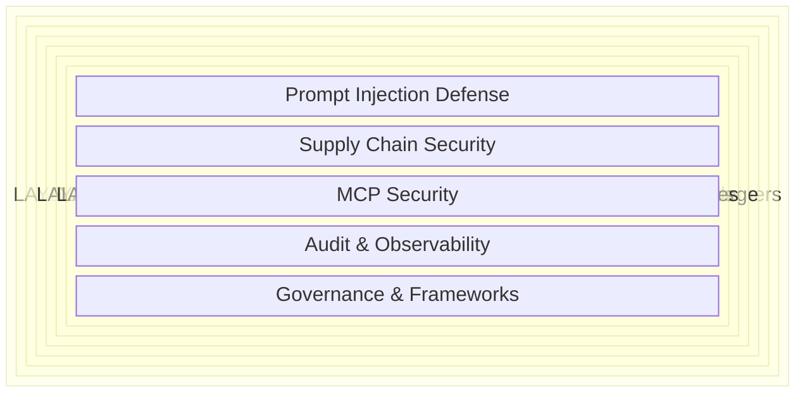

# Defense-in-Depth Layer Model

## Mermaid Diagram



## ASCII Fallback

For terminals and environments that do not render Mermaid:

```
┌─────────────────────────────────────────────────────────────────────────┐
│ LAYER 1: Infrastructure Isolation (Cloud Dev Envs, MicroVMs, Containers)│
│ ┌─────────────────────────────────────────────────────────────────────┐ │
│ │ LAYER 2: OS Sandboxing (Seatbelt, bubblewrap, seccomp, Landlock)   │ │
│ │ ┌─────────────────────────────────────────────────────────────────┐ │ │
│ │ │ LAYER 3: Network Controls (Egress Filtering, Agent Proxies)     │ │ │
│ │ │ ┌─────────────────────────────────────────────────────────────┐ │ │ │
│ │ │ │ LAYER 4: Filesystem & Permissions (.aiignore, Allowlists)   │ │ │ │
│ │ │ │ ┌─────────────────────────────────────────────────────────┐ │ │ │ │
│ │ │ │ │ LAYER 5: Secrets (Env Scrubbing, Credential Brokers)    │ │ │ │ │
│ │ │ │ │ ┌─────────────────────────────────────────────────────┐ │ │ │ │ │
│ │ │ │ │ │ LAYER 6: Human-in-the-Loop (Approvals, Permissions) │ │ │ │ │ │
│ │ │ │ │ │ ┌─────────────────────────────────────────────────┐ │ │ │ │ │ │
│ │ │ │ │ │ │ L7:  Prompt Injection Defense                   │ │ │ │ │ │ │
│ │ │ │ │ │ │ L8:  Supply Chain Security                      │ │ │ │ │ │ │
│ │ │ │ │ │ │ L9:  MCP Security                               │ │ │ │ │ │ │
│ │ │ │ │ │ │ L10: Audit & Observability                      │ │ │ │ │ │ │
│ │ │ │ │ │ │ L11: Governance & Frameworks                    │ │ │ │ │ │ │
│ │ │ │ │ │ └─────────────────────────────────────────────────┘ │ │ │ │ │ │
│ │ │ │ │ └─────────────────────────────────────────────────────┘ │ │ │ │ │
│ │ │ │ └─────────────────────────────────────────────────────────┘ │ │ │ │
│ │ │ └─────────────────────────────────────────────────────────────┘ │ │ │
│ │ └─────────────────────────────────────────────────────────────────┘ │ │
│ └─────────────────────────────────────────────────────────────────────┘ │
└─────────────────────────────────────────────────────────────────────────┘

← Outer layers = stronger isolation, harder to bypass
→ Inner layers = application-level controls, easier to bypass but still valuable
```

## Layer Summary Table

| Layer | Category | Enforcement Mechanism | Bypass Difficulty | Agents with Native Support |
|-------|----------|----------------------|-------------------|---------------------------|
| 1. Infrastructure Isolation | Hardware/VM boundary | Hypervisor, kernel isolation | Very Hard (requires VM escape) | Codespaces, E2B |
| 2. OS Sandboxing | Kernel-level MAC | Syscall filtering, filesystem ACLs | Hard (requires kernel exploit) | Claude Code, Cursor |
| 3. Network Controls | Network layer | Firewall rules, proxy enforcement | Hard (requires proxy bypass) | Claude Code (with config) |
| 4. Filesystem & Permissions | Application-level access control | Allowlists, ignore files | Medium (known bypasses exist) | All major agents |
| 5. Secrets Management | Credential isolation | Env scrubbing, token rotation | Medium (side-channel possible) | Requires manual config |
| 6. Human-in-the-Loop | Process control | Approval prompts, confirmation gates | Easy (social engineering, fatigue) | Claude Code, Copilot CLI |
| 7. Prompt Injection Defense | Input/output validation | Filtering, detection models | Easy-Medium (41-83% bypass rate) | Partial in Claude Code |
| 8. Supply Chain Security | Dependency verification | Scanning, lockfiles, SBOM | Medium (novel packages hard to detect) | Requires external tooling |
| 9. MCP Security | Protocol-level trust | OAuth, mutual auth, capability scoping | Easy (72%+ tool poisoning success) | Evolving rapidly |
| 10. Audit & Observability | Detection & response | Logging, anomaly detection | N/A (detective, not preventive) | Partial across tools |
| 11. Governance & Frameworks | Organizational policy | Standards, training, review processes | N/A (process, not technical) | N/A |

## Key Principle

> Each outer layer protects against failures in all inner layers. Even if prompt injection succeeds (Layer 7), OS sandboxing (Layer 2) limits what the compromised agent can do, and network controls (Layer 3) prevent data exfiltration. **No single layer is sufficient. The architecture derives its strength from the combination.**
